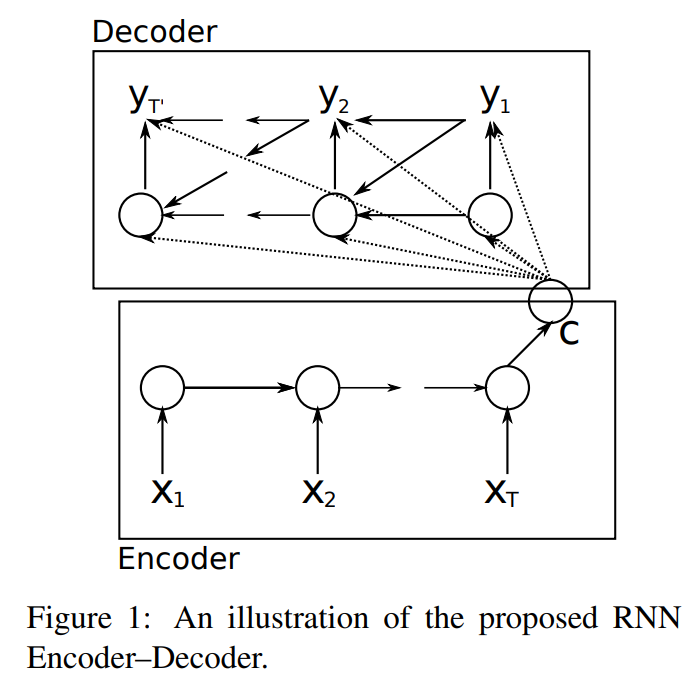

# RNN-Encoder-Decoder-Implementation

"Learning Phrase Representations using RNN Encoder–Decoder for Statistical Machine Translation" by Kyunghyun Cho, Bart van Merrienboer, Caglar Gulcehre, Dzmitry Bahdanau, Fethi Bougares, Holger Schwenk, Yoshua Bengio.

Paper: https://arxiv.org/pdf/1406.1078.pdf

## Architecture



Only working to implement the model. No training and evaluation scripts here.

## Citation

```bibtex
@misc{cho2014learning,
      title={Learning Phrase Representations using RNN Encoder-Decoder for Statistical Machine Translation}, 
      author={Kyunghyun Cho and Bart van Merrienboer and Caglar Gulcehre and Dzmitry Bahdanau and Fethi Bougares and Holger Schwenk and Yoshua Bengio},
      year={2014},
      eprint={1406.1078},
      archivePrefix={arXiv},
      primaryClass={cs.CL}
}
```

